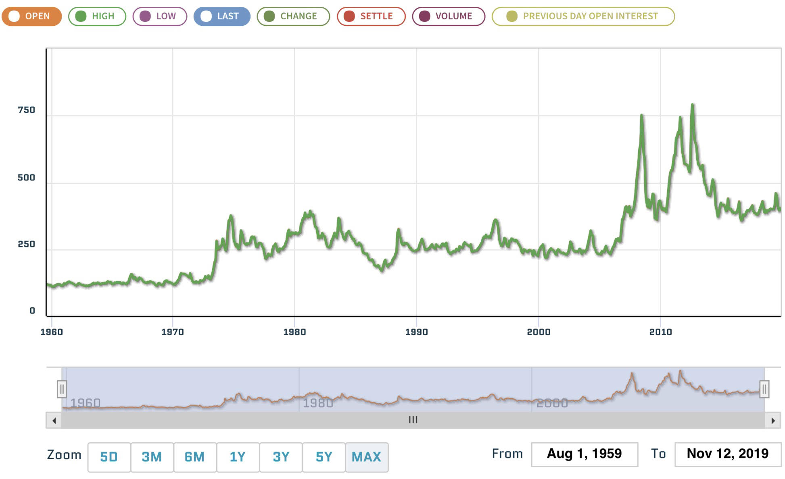
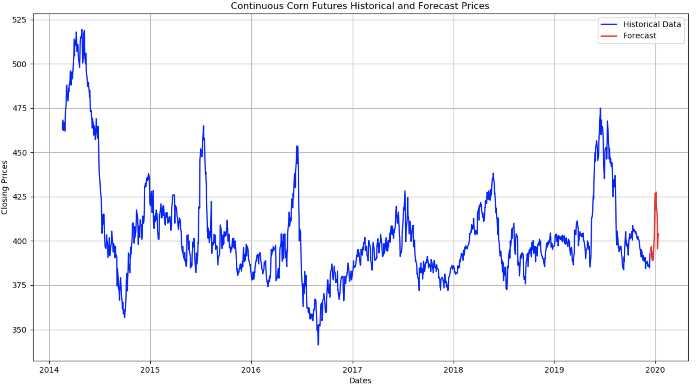

# Corn futures price prediction model (“Model”)

## Technical parameters

### Assumptions in the Model
1. The Model is pre-trained with 10years worth of data and additional noise added to help counter biases. There is no need to fit the Model to the Data;
2. The Model currently makes predictions 30 days ahead of the actual historical data; and
3. The Model is designed to be flexible in terms of prediction days (see item 2) and feature count. The Model can use more features than listed above. current version has no option for the user to change the prediction days value from 30.

### Technical architecture

The Model is an LSTM/feed forward neural network combination. Hyper-parameters are tuned with bayesian algorithm to optimise the model architecture and run-time.
The training also took into consideration a noisy data as well as other regularisation techniques to minimise the effect of biases.
Model has function built-in to format the input Data to a relevant tensor for predictions.

## Input

### Input information (“Data”)

https://www.quandl.com/data/CHRIS/CME_C5

Input format is **.csv** . No transofrmation required on the downloaded dataset.

### Details of the Data

The ZC1! Continuous corn futures data is related to CBOT (Chicago commodity stock exchange) tradings based on the North American production and demand.
The Data is a daily break down of the continuous futures prices with additional features which are helpful for prediction purposes.

#### Data structure and acceptable format

|  Column    |     Decription            |         Acceptable Format  |    Comment|
|------------|---------------------------|----------------------------|-----------|
|Open        |    Opening price of the day |       Float or Int       |  
|High        |    Highest price of the day |       Float or Int       |
|Low         |    Lowest price of the day  |       Float or Int       |
|Last        |    Closing price of the day |       Float or Int       |     Target value to predict
|Change      |    Price change DoD         |       Float or Int       |
|Settle      |    The price used for determining profit or loss for the day, as well as margin requirements         |       Float or Int       |
|Volume      |    Trading volume   |       Float or Int       |
|Previous day open Interest      |    The total number of outstanding contracts that are held by market participants   |       Float or Int       |

No transformation is required on the downloaded data. The Model can handle the output of Quandl as is.
Data frequency is daily.

## Output
Outputs are:
1. Graph that renders the Forecasts against the historical Data.
2. HTML table that also shows all the new datapoints generated.

## API call
When you run the code navigate to http://127.0.0.1:5000/. This home page will guide you through on the necessary steps:
    1. upload the data
    2. Click on Predict

The Landing page will show the results of the model in Graph and Table format as for the next 30 days. 

## API call through the cloud
The Model is also available in the following cloud address:
http://corn1612-env.4ewvmihpbn.us-east-2.elasticbeanstalk.com/

All the input and output data are the same as the local implementation of the Model.

## Dependencies
1. import os
2. import requests
3. import numpy as np
4. import tensorflow as tf
5. import pandas as pd
6. from sklearn.preprocessing import MinMaxScaler
7. from flask import Flask, request, jsonify, render_template, redirect
8. import matplotlib.pyplot as plt
9. from io import BytesIO
10. import base64
11. import datetime
